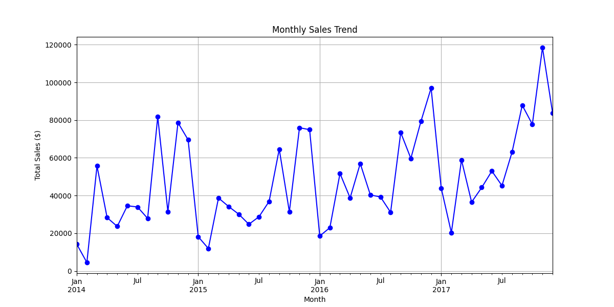
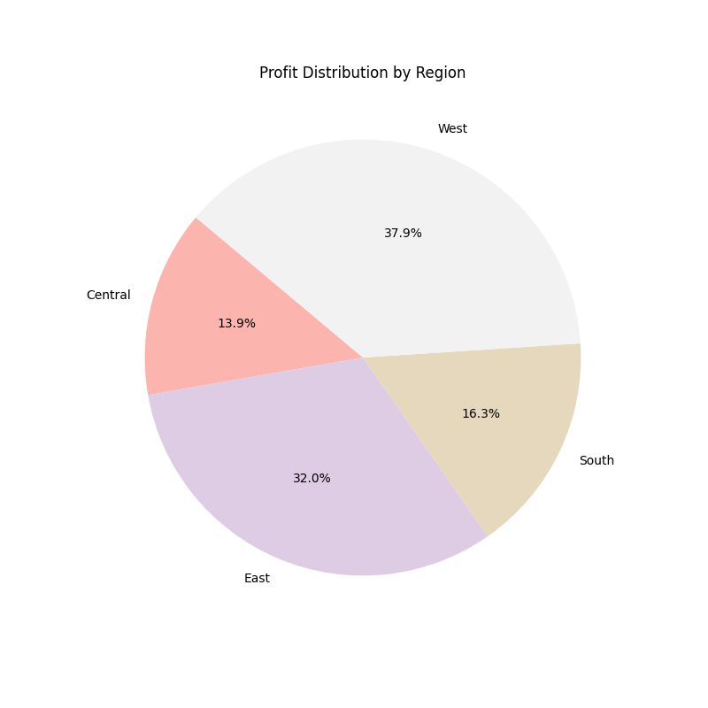

# Business Sales Performance Analytics (Task 1)
**Author:** Medapati Siddhartha Reddy
**CIN ID:** FIT/JAN26/DS11544
**Tool Used:** Python (Pandas, Matplotlib)

## Problem Statement
Analyze business sales data to identify revenue trends, top-selling products, and regional performance to suggest growth strategies.

## Key Insights
* **Sales Trends:** Sales show a steady increase with peaks during holiday seasons (see `1_sales_trend.png`).
* **Top Products:** The Canon imageCLASS printer is the highest revenue-generating product.
* **Regional Performance:** The West region accounts for the highest share of profits (see `3_region_profit.png`).

## Visualizations

